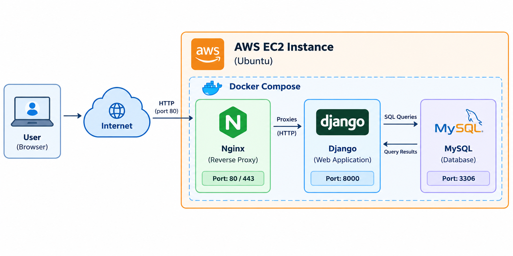
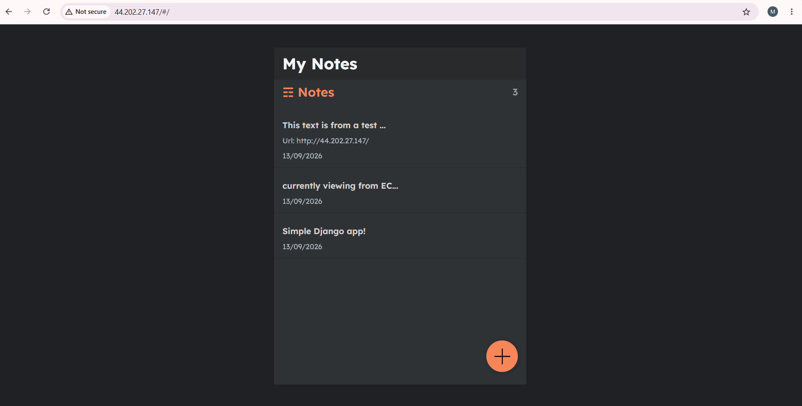
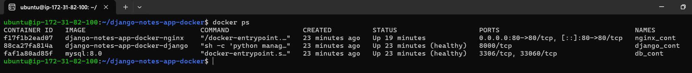
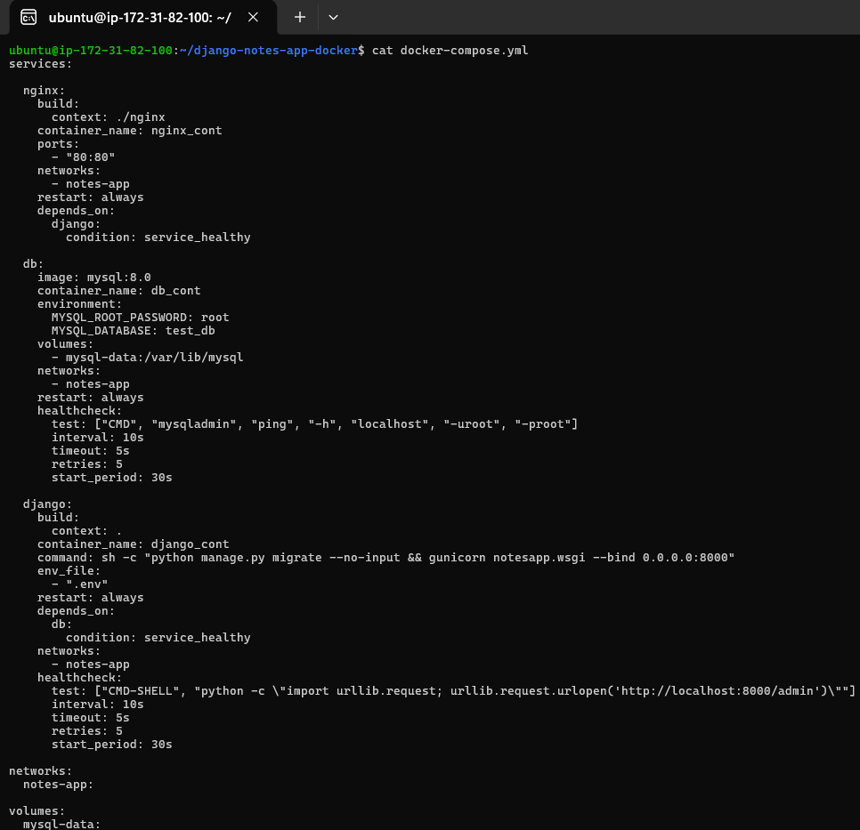
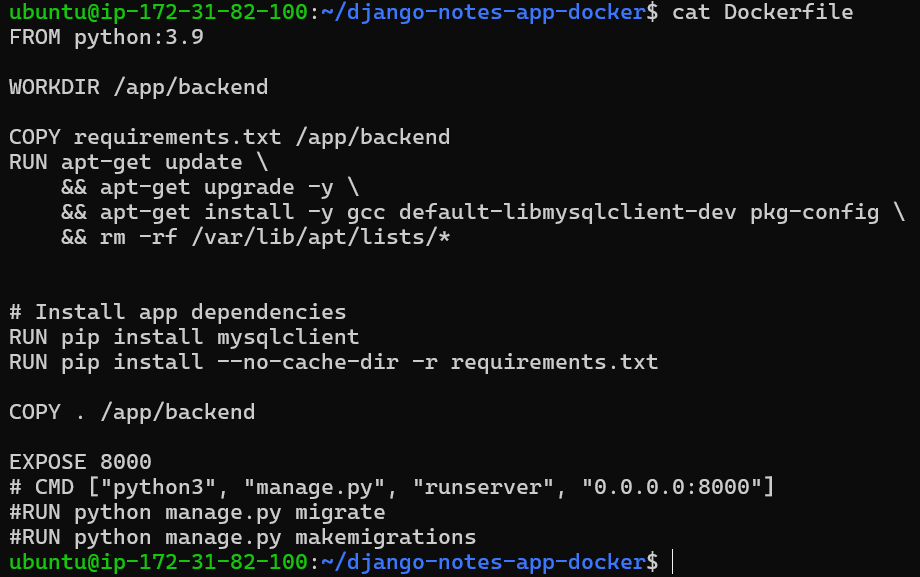
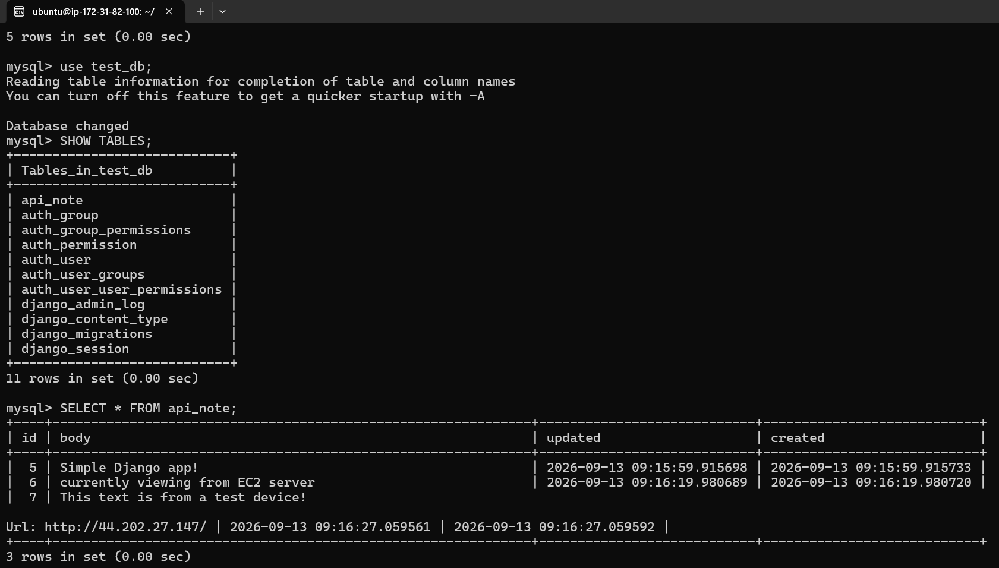
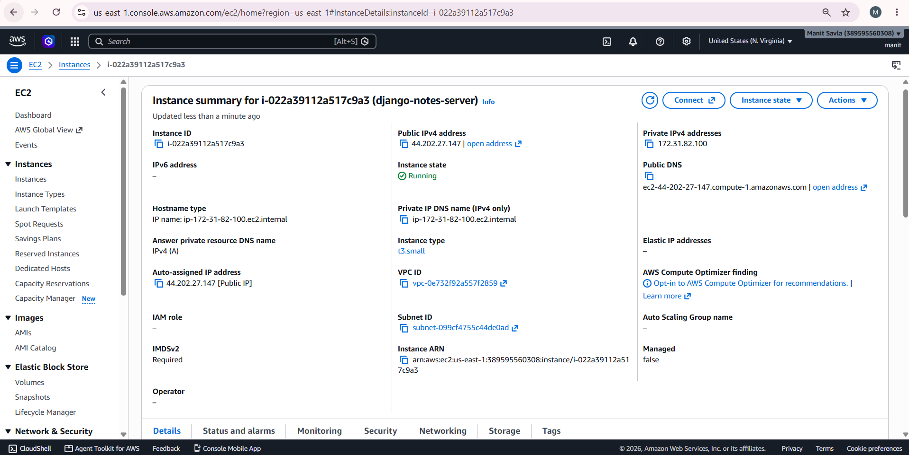
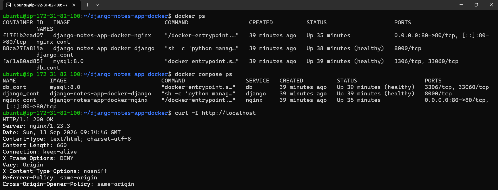

# Django Notes App

A Django-based Notes application containerized with Docker and deployed on AWS EC2.

## 🏗️ Architecture



**Flow:**

`User → AWS EC2 → Nginx → Django → MySQL`

Docker Compose is used to manage the application services.

## 🛠️ Tech Stack

- **Backend:** Django, Python
- **Database:** MySQL
- **Containerization:** Docker, Docker Compose
- **Web Server:** Nginx
- **Cloud:** AWS EC2
- **OS:** Ubuntu
- **Version Control:** Git, GitHub

## ✨ Features

- Create, view, update and delete notes
- MySQL database integration
- Dockerized Django application
- Multi-container setup using Docker Compose
- Nginx reverse proxy
- AWS EC2 deployment

## 📸 Screenshots

### Application



### Docker Containers



### Docker Compose



### Dockerfile



### MySQL Database



### AWS EC2



### Deployment Verification



## ☁️ Deployment

The application is deployed on an Ubuntu AWS EC2 instance using Docker Compose.

```text
Local Development
       ↓
     Docker
       ↓
 Docker Compose
       ↓
    AWS EC2
       ↓
     Nginx
       ↓
    Django
       ↓
    MySQL
```

## 📈 Future Improvements

- GitHub Actions CI/CD
- Automated testing and deployment
- HTTPS and custom domain
- AWS RDS for MySQL
- Prometheus & Grafana monitoring
- Terraform for Infrastructure as Code
- Kubernetes deployment

## 📚 Key Learnings

- Django application development
- Docker & Docker Compose
- Linux and SSH
- Nginx reverse proxy
- AWS EC2 deployment
- Containerized application deployment
- Basic DevOps workflow

## 👨‍💻 Author

**Manit Savla**

Backend • Cloud • DevOps
